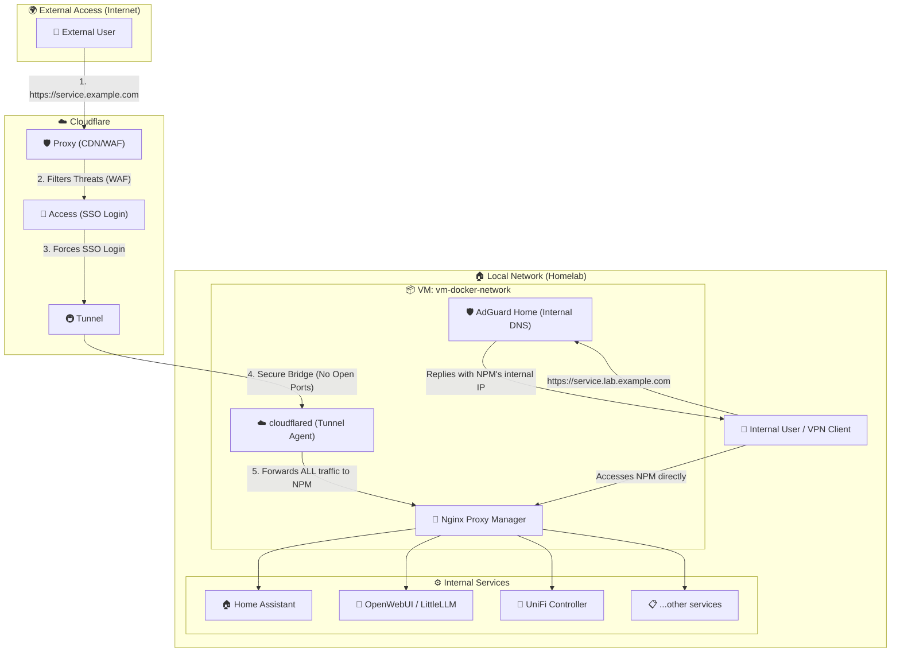
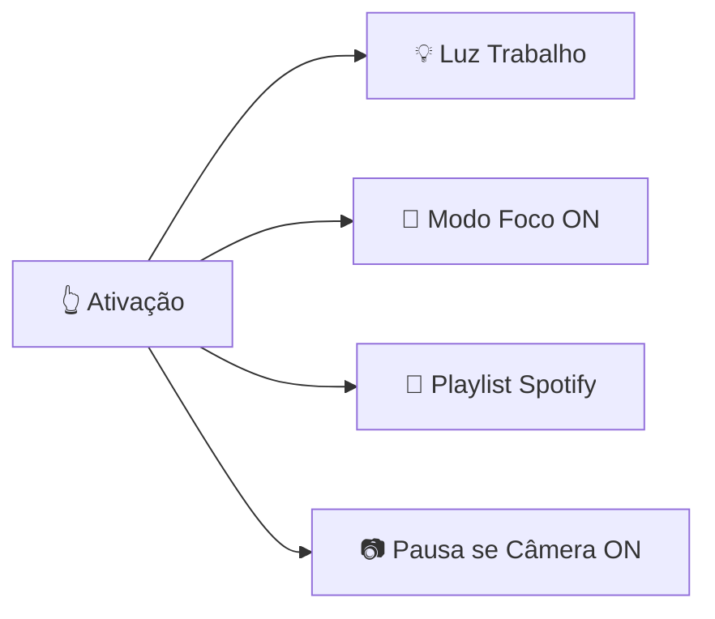
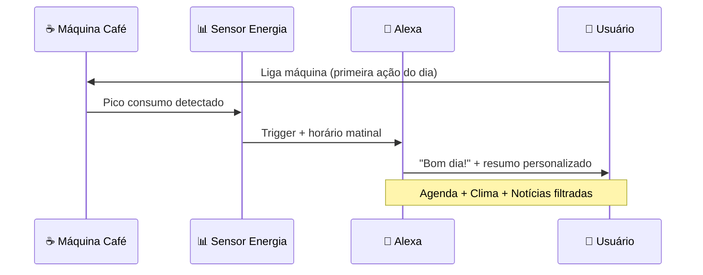
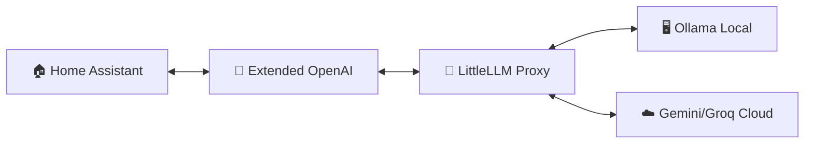

# 🧠 Home Assistant: O Cérebro do Meu Homelab

<div align="center">


*O orquestrador central e interface de controle para toda a minha casa e homelab*

**Uma peça fundamental na minha jornada de transição de carreira:**  
*Videomaker → Engenheiro de IA & DevOps*

</div>

---

## 🎯 **Filosofia do Projeto**

> *"Construindo soluções que unem criatividade e eficiência técnica"*

Com 10 anos de experiência no audiovisual, aplico os mesmos princípios criativos na construção desta infraestrutura inteligente:

| 🎯 **Prática** | 🔄 **Evolutiva** | 📚 **Documentada** | 🔒 **Segura** |
|----------------|------------------|---------------------|----------------|
| Resolve problemas do dia a dia | Aprimoramento contínuo | Base sustentável | Arquitetura Zero Trust |
| Controle de luzes a firewall | Novas automações regulares | Escalabilidade garantida | Segurança não negociável |

---

## 🏛️ **Arquitetura & Contexto**

### **Stack Tecnológico**
- **Host:** Servidor Debian baixo consumo
- **Virtualização:** Proxmox VE
- **Containers:** Docker + Portainer
- **Segurança:** Zero Trust Network Access

### **Diagrama de Acesso Seguro**



---

## 📊 **Dashboards em Destaque**

### 🏠 **Home - O Hub Central de Controle**

<div align="center">

*Dashboard principal para o dia a dia*  
**Controle intuitivo e rápido sobre todos os dispositivos IoT**

</div>

#### **🔥 Principais Funcionalidades:**

<table>
<tr>
<td width="50%">

**💡 Controle de Iluminação**
- Luzes inteligentes (Yeelight, Philips Hue)
- Projetos DIY (ESP32 + WLED + WS2812B)
- Rede Zigbee dedicada
- Sensores de presença + baixa latência

**🎵 Gerenciamento de Mídia**
- Amazon Echo, Google Home, Spotify
- Controle de energia TV Samsung
- Controle unificado de players

</td>
<td width="50%">

**📱 Monitoramento Pessoal**
- Nível de bateria iPhone
- Status Apple Watch
- Status MacBook
- Cards informativos em tempo real

**🌤️ Informações Ambientais**
- Previsão do tempo
- Horários nascer/pôr do sol
- Contexto ambiental

</td>
</tr>
</table>

### 🌐 **Network & Security - Central de Controle**

<div align="center">

*NOC (Network Operations Center) completo no Home Assistant*  
**Visibilidade e controle granular da infraestrutura**

</div>

#### **🚀 Principais Funcionalidades:**

| 📡 **Infraestrutura UniFi** | 📶 **Wi-Fi Dinâmico** | 🛡️ **AdGuard Control** | 🔥 **Firewall Rules** |
|----------------------------|----------------------|------------------------|---------------------|
| Status tempo real | Redes segmentadas | Estatísticas bloqueio | Switches dinâmicos |
| Uptime, CPU, Memória | QR Code para acesso | Módulos proteção | Regras HA ↔ IoT VLAN |
| Reinicialização remota | Toca da Cacau/Sayuri/Mochi | Controle granular | Gestão automatizada |

---

## ⚡ **Automações em Destaque**

### 🛒 **Lista de Compras Inteligente**

```yaml
# Fluxo da Automação
Adição de Item → Lista Compartilhada → Detecção de Localização → Notificação Proativa
```

**Como funciona:**
- Lista compartilhada entre casal
- Zonas de supermercados configuradas
- Detecção automática de chegada
- Notificação com lista completa

---

### 🎬 **Modo Foco de Trabalho (Work Mode)**

<div align="center">

**Um clique. Múltiplas ações. Produtividade máxima.**

</div>

#### **Triggers Disponíveis:**
- 🔘 Botão Zigbee no escritório
- 🗣️ Comando de voz via Siri
- ⌚ Apple Watch (HomeKit)

#### **Ações Executadas:**


---

### 🚀 **Alerta de Commit (DevOps)**

**Integração com fluxo de desenvolvimento:**
- 📧 Notificação mobile instantânea
- 💡 Pisca luz da mesa (alerta periférico)
- 🔔 Feedback visual + sonoro
- 👥 Monitora commits da equipe

---

### 🏠 **Modo Ausente Automático**

**Geolocalização combinada do casal:**
- 📍 Detecção saída simultânea
- 💡 Desliga luzes automaticamente
- ⚡ Otimização consumo energia
- 🔒 Rotina segurança ativada

---

### ☕ **Bom Dia Personalizado** `[EM DESENVOLVIMENTO]`

<div align="center">

**Próxima automação a ser implementada**

</div>

#### **Fluxo Planejado:**


---

## 🤖 **AI Hub: Inteligência Artificial Integrada**

<div align="center">

**Assistente de IA híbrido: Local + Nuvem**

</div>

### **Arquitetura de IA:**



**Benefícios:**
- 🏠 **Modelos Locais:** Privacidade total via Ollama
- ☁️ **Modelos Cloud:** Poder computacional avançado
- 🔄 **Proxy Unificado:** Interface única para múltiplos LLMs
- 🎯 **Flexibilidade Total:** Melhor modelo para cada tarefa

---

## 🛠️ **Implementação Técnica**

### **🔌 Integrações Essenciais**

<details>
<summary><strong>📡 Infraestrutura e Rede</strong></summary>

- **UniFi Network** - Controle e monitoramento profissional
- **AdGuard Home** - Gerenciamento DNS e bloqueios
- **Proxmox VE** - Status VMs e host

</details>

<details>
<summary><strong>🌐 Protocolos IoT</strong></summary>

- **Zigbee** - Rede baixa latência (ZHA/Zigbee2MQTT)
- **MQTT** - Broker para comunicação desacoplada

</details>

<details>
<summary><strong>🏠 Ecossistema e Interoperabilidade</strong></summary>

- **HomeKit Bridge** - Integração completa Apple
- **Google Assistant / Alexa** - Controle por voz

</details>

<details>
<summary><strong>🤖 Inteligência Artificial</strong></summary>

- **LittleLLM** - Proxy unificado para LLMs
- **Ollama** - Modelos de linguagem locais
- **Extended OpenAI Conversation** - Integração HA

</details>

<details>
<summary><strong>💡 Controle e Dados</strong></summary>

- **Iluminação:** Yeelight, Philips Hue, WLED (ESP32)
- **Mídia:** Spotify, Broadlink, SmartThings
- **Sensores:** Mobile App + dados dispositivos

</details>

<details>
<summary><strong>🛡️ Manutenção e Operações</strong></summary>

- **Google Drive Backup** - Backups automáticos nuvem
- **RESTful Sensors** - Monitoramento serviços homelab

</details>

---

## 🛡️ **Backup e Recuperação de Desastres**

<div align="center">

**Estratégia de backup automatizada e resiliente**

</div>

### **Características do Sistema:**

| 🤖 **Automação** | ☁️ **Off-site** | 🔄 **Retenção** | 📊 **Monitoramento** |
|------------------|-----------------|------------------|---------------------|
| Snapshots regulares | Google Drive | Gestão automática | Status nos dashboards |
| Zero intervenção | Seguro fora do hardware | Otimização espaço | Alertas falhas |

---

## 📊 **Monitoramento de Serviços**

**Sensores RESTful para saúde da infraestrutura:**

<details>
<summary><strong>📝 Exemplo de Configuração (configuration.yaml)</strong></summary>

```yaml
# Monitoramento de serviços self-hosted
rest:
  # Nginx Proxy Manager - Status página login
  - resource: http://192.168.1.39:81/
    timeout: 10
    scan_interval: 60
    headers:
      User-Agent: "Home Assistant"
    binary_sensor:
      - name: "Nginx Proxy Manager Status"
        icon: mdi:gate-arrow-right
        value_template: "{{ 'html' in value }}"

  # Portainer - Status API endpoint
  - resource: http://192.168.1.232:3010/api/status
    timeout: 10
    scan_interval: 60
    headers:
      User-Agent: "Home Assistant"
    binary_sensor:
      - name: "Portainer Status"
        icon: mdi:docker
        value_template: "{{ value_json.status == 'UP' }}"
```

</details>

---

## 🗺️ **Roadmap - Próximos Passos**

<div align="center">

*"A automação é uma jornada, não um destino"*

</div>

### **Em Progresso:**
- [x] 🎯 **Bom Dia Personalizado** - Finalizar automação café

### **Planejado:**
- [ ] ⚡ **Dashboards de Energia** - Monitoramento consumo + otimização
- [ ] 🔧 **Componentes Custom** - Desenvolvimentos Python próprios
- [ ] 📹 **Monitor Render Vídeo** - Integração com background videomaker

---

<div align="center">

## 🙏 **Obrigado pela Visita!**

*Sinta-se à vontade para explorar o repositório e contribuir com ideias.*

**Conecte-se comigo:**
[](https://linkedin.com)
[](https://github.com)

---

**⭐ Se este projeto foi útil, considere dar uma estrela!**

*Construído com ❤️ e muito ☕ por um videomaker em transição para DevOps/AI*

</div>
